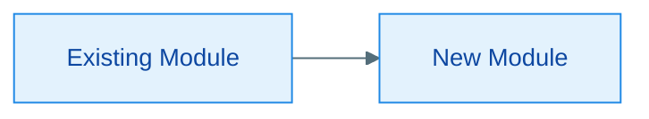
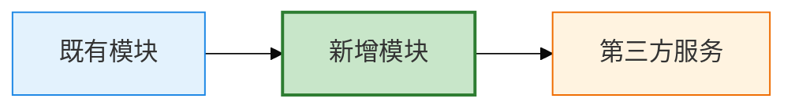

# sdd-design

Turn an approved spec into a **technical design document** — the "how" that the spec's "what" implies. The design is reviewed before tickets are split, so a wrong architecture fails here, not mid-implementation.

## Input

- The approved spec (from `.workflow/specs/`)
- Domain glossary (`.workflow/context.md`)
- Existing codebase context (relevant modules, conventions, ADRs if any)
- The seams proposed in the spec's 测试决策 section

## Design document template

Use `templates/design.md`（10 章完整模板）作为**唯一模板**，按其中章节结构输出到 `.workflow/designs/<NNN>-<中文名>.md`——**必须与对应 spec 同名**（同 NNN + 同中文名，靠 designs/ 目录区分），如 spec `001-用户登录.md` → design `001-用户登录.md`。

> 本 skill 不再内嵌简版模板——`templates/design.md` 是唯一事实来源，避免模板漂移。模板章节如有不适用项，显式声明"不适用"，不得留空。

## Diagram rules (Mermaid)

- **Always use Mermaid** (```mermaid code blocks) — native Markdown rendering. Never PlantUML, screenshots, or hand-drawn ASCII as diagrams.
- **On demand, never for decoration**: the architecture diagram is required in section 1; class/ER/sequence/state diagrams only when the corresponding design has real content (OO core types, entity relationships, nontrivial multi-module flows, state machines).
- **A diagram must carry meaning**: it should be readable standalone, with a one-line caption of what it conveys. No decorative diagrams.
- **Must render**: self-check Mermaid syntax (nodes, relations, closed code fences) before finishing — a broken diagram is worse than none.
- Diagram type per section: architecture → `flowchart`; OO types → `classDiagram`; entities → `erDiagram`; state → `stateDiagram-v2`; cross-module flow → `sequenceDiagram`; decision flow → `flowchart`.

### Diagram quality standards (each diagram must satisfy all)

1. **Has a caption**: one line above the diagram stating what it conveys (e.g. `图 1-1：新增模块与既有模块的依赖关系`).
2. **Standalone-readable**: does not depend on surrounding prose — complete node names, explicit relation directions.
3. **Not overloaded**: one diagram = one topic; split if > 12 nodes. Never cram 20 nodes into one.
4. **Renders**: Mermaid syntax valid (nodes closed, relations directed, code fences closed).
5. **Consistent style**: use the standard styling below across the whole document.

### Standard Mermaid styling

**Unified theme via init block** (prevents renderer drift):



**classDef role coloring** (distinguish added / existing / third-party):



**Color convention**:
- New/added modules → green fill (`added`)
- Existing modules → blue fill (`existing`)
- Third-party / external services → orange fill (`thirdparty`)
- Sequence diagrams → role-based layering, highlight key messages; state diagrams → base theme with domain vocabulary state names.

## Quality bar

- **Design the "how", not the "what"** — the spec already decided the what; repeat only what the design needs as context.
- **Prefer deep modules** — a lot of behavior behind a small, clear interface. Fewer, well-bounded modules beat many shallow ones.
- **No invented justification** — every tech/pattern choice gets a real reason or is marked "forced by existing stack".
- **Cover the seams from the spec** — the 测试决策 section named seams; the design must show how the implementation reaches them.
- **Flag risks honestly** — a design with no risks section reads as unexamined, not as perfect.
- **No speculative generality** — design only what the spec requires.
- Write in Chinese; keep code snippets minimal (signatures only, no full implementations).

## Output

- The design document at `.workflow/designs/`
- Hand off to the orchestrator for **design review** (sdd-design-review via @reviewer) — do not proceed to tickets until the review passes.

## Spec ↔ design correspondence (1:1)

- **One spec → one design document** (`.workflow/designs/<NNN>-<中文名>.md`, 与 spec 同名), regardless of how many increments the spec accumulates.
- Increments **amend the same design document** (relevant sections + 变更记录 table row), never a new document.
- Only a **major redesign** (the whole architecture is reworked) supersedes the old design and creates a new one (`status: superseded` + reference the new design). The **spec stays the same** unless the capability itself changed — if the capability domain changed, that is a new spec (see sdd-spec boundary rules).
- The design frontmatter `spec` field links the two; the spec's 实现决策 stays at decision level while the design document carries the technical detail.

## Design lifecycle & maintenance

The design document is a living artifact with explicit states. Its lifecycle:

```
draft ──设计评审──> reviewed ──评审通过──> approved（设计固定）──实现──> 随代码演进（可被修正/superseded）
```

### 1. When is a design "fixed"?

- A design becomes **fixed (approved)** only after `sdd-design-review` passes (Approved verdict) AND the user has seen the review result.
- From `approved` onward, the design is the **implementation baseline**: tickets are split from it, implementers code against it.
- Before `approved`, it is a draft and can be freely amended in response to review findings.

### 2. Must the design be updated when code changes?

Three cases, three answers:

| 情况 | 是否更新设计文档 |
|------|----------------|
| **轻量修改**（不改接口/架构/数据模型/安全/非功能设计——如改文案、改样式） | **不更新设计文档**，只写 `.workflow/changes/` 记录 |
| **实现偏差**（实现时发现设计与实际不符，或需要偏离设计） | **必须更新设计文档**——修改对应章节 + 在「变更记录」表追加一行（触发点：实现偏差）。若偏差改变了已评审的接口/架构/数据决策，**需重新评审**（@reviewer 复审变更部分） |
| **增量需求影响既有设计** | 走 s2 的增量设计流程，在原设计文档上追加/修订章节 + 变更记录，重新评审 |

### 3. Rules

- **Never silently diverge**: if implementation cannot follow the approved design, the deviation must be recorded in the design document — not just in code comments or changes/.
- **Stale design is debt**: a design that no longer matches the code is worse than no design. The 变更记录 table exists to keep the design honest.
- **Superseded**: when a later design replaces this one (major redesign), set frontmatter `status: superseded` and reference the new design — do not delete.
- The orchestrator enforces: after implementation, if the code drifted from the approved design, the design doc must be updated before the spec can be marked completed.
