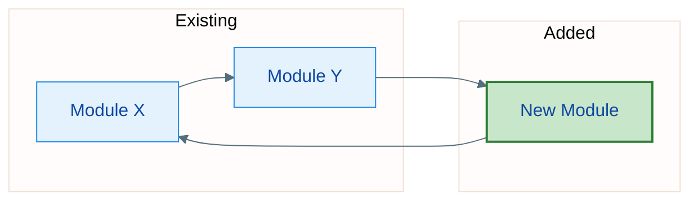
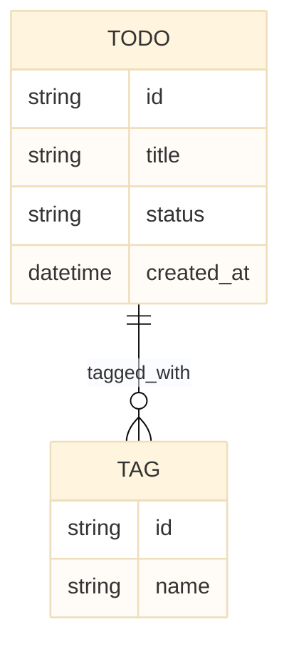
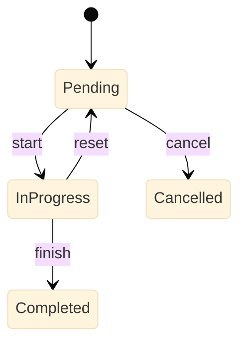
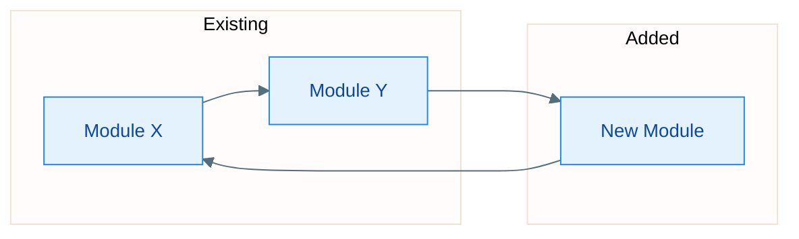

> **文件名规范**：`.workflow/designs/<NNN>-<中文名>.md`
> - **必须与对应 spec 同名**（同 `NNN` + 同中文名，靠 `designs/` 目录区分）——保证 spec↔design 1:1 关联
> - 例：spec `001-用户登录.md` → design `001-用户登录.md`
> - 中文名 + `-` 连接，不用空格/下划线/英文缩写

> **适用性声明**：本模板按 `system_type` 区分各章必填/可选/不适用。
> 章节标题前标注：
> - **[必填]** —— 所有系统类型都必须写
> - **[按需]** —— 该系统类型有实质内容才写，无则显式声明"不适用"
> - **[仅 web/服务型]** —— 仅 web 应用/后端服务等网络系统需要
>
> 空章节必须写"不适用"并一句话说明原因，不得留白。

## 0. 系统概述与范围 **[必填]**

- **系统类型**：`system_type` 值
- **一句话定位**：这个系统做什么、给谁用
- **部署形态**：运行环境（浏览器/服务器/CLI/桌面/嵌入式）、进程模型（单进程/多服务/无服务器）
- **边界**：本设计覆盖什么、明确不覆盖什么（超出 spec 范围的）
- **主要外部依赖**：运行时、框架、外部服务、第三方库（版本）

## 1. 模块设计 **[必填]**

Module/component breakdown and their responsibilities, dependencies, and boundaries.

**图（必填）**: 架构图 via Mermaid `flowchart`，带 init 样式 + classDef 着色 + 图标题；**生成前先读末尾「图的使用规范 → 图的生成规范」**（方向单一 / subgraph 分组 / 节点≤20·边≤30 / 统一 init / 禁用 ELK）：

图 1-1：新增模块与既有模块的依赖关系



For each new/changed module:
- **职责**：what the module owns
- **依赖**：what it depends on (clean dependency direction?)
- **边界**：what it does NOT do

**系统类型适配**：
- 前端-only：按"视图层 / 状态层 / 数据访问层"拆模块，标注组件树
- 库：按"公开 API 面 / 内部实现"拆，标注哪些是导出、哪些是内部
- 数据管道：按"采集 / 转换 / 存储 / 输出"拆阶段

## 2. 接口设计 **[必填]**

### 2.1 接口清单

| 接口 | 类型 (API/UI/内部函数/CLI) | 功能简述 | 所属模块 |
|------|--------------------------|---------|---------|
| POST /api/todos | API | 新增待办 | todo-service |
| TodoService.addTodo() | 内部函数 | 新增待办逻辑 | todo-service |

### 2.2 接口详情（按类型选模板）

**类型 A：HTTP API** **[仅 web/服务型]**

- **接口地址**: `POST /api/todos`
- **功能描述**: 创建一个新的待办事项
- **接口流程**: 1. 校验请求参数 → 2. 生成 id → 3. 持久化 → 4. 返回
- **入参 (Request)**:
  ```json
  { "title": "买菜", "due_date": "2026-08-30", "priority": "high" }
  ```
- **出参 (Response - 200 OK)**:
  ```json
  { "id": "a1b2c3", "title": "买菜", "status": "pending" }
  ```
- **错误码**: | 状态码 | 场景 | 示例 |
- **时序图**（多模块交互时）: Mermaid `sequenceDiagram`，带标题：

  图 2-1：新增待办调用链（UI → API → Store）

  ```mermaid
  %%{init: {"theme": "base"}}%%
  sequenceDiagram
      participant UI
      participant API
      participant Store
      UI->>API: POST /api/todos
      API->>API: validate
      API->>Store: persist(todo)
      Store-->>API: ok
      API-->>UI: 201 created
  ```

**类型 B：UI 组件接口** **[按需，前端型]**

- **组件名 / Props / Events / Slots**:
  | Prop | 类型 | 默认 | 说明 |
  |------|------|------|------|
  | items | Todo[] | [] | 待办列表 |
- **状态契约**：组件受控/非受控，状态提升到哪
- **交互流程**：Mermaid `sequenceDiagram`（用户操作 → 组件 → 状态层 → 数据层）

**类型 C：内部函数/库 API** **[按需]**

- **签名**: `addTodo(title: string, priority?: Priority): Todo`
- **契约**: 前置条件 / 后置条件 / 抛错情况 / 不变式
- **导出面**: 哪些公开导出、哪些内部（库特有）

**类型 D：CLI 命令** **[按需，cli-tool]**

- **命令**: `todo add "买菜" --priority high`
- **参数/选项表**: | 参数 | 类型 | 必填 | 默认 | 说明 |
- **退出码**: 0=成功, 1=运行时错误, 2=用法错误
- **stdin/stdout/stderr 契约**、管道友好性

## 3. 数据设计 **[必填]**

覆盖所有存储形态：数据库 / localStorage / 内存 / 文件 / 缓存。

**图（有实体关系时）**: Mermaid `erDiagram`（数据库型）；无关系则省略。带标题：

图 3-1：待办与标签的实体关系



**存储决策**：选型 + 理由（DBMS / in-memory / localStorage / 文件 / 缓存），以及"为什么不是其他选项"（或被既有栈强制）。

**数据模型**（按存储形态选）：

- **关系型（表）**: | 字段 | 类型 | 约束 | 说明 | + 索引/唯一约束/迁移
- **文档型**: 集合 + 文档结构 + 索引
- **键值/localStorage**: key 命名空间 + value 结构 + 序列化格式 + 容量考虑
- **内存态**: 数据结构（Map/Array）+ 生命周期 + 序列化时机
- **文件**: 文件格式（JSON/CSV/binary）+ 目录布局 + 原子写

**数据生命周期**：创建 → 变更 → 归档 → 删除；保留策略
**迁移**（schema 变更时）: expand–contract 或版本化迁移

## 4. 安全设计 **[必填，按适用性声明]**

> 以下维度按系统类型取舍，不适用项显式声明"不适用（原因）"。**库/CLI 无网络面可省网络相关，但输入校验/敏感数据处理仍适用。**

### 4.1 威胁模型 [按需，网络型必做]

用 **STRIDE** 快速过一遍，标注哪些威胁适用：
| 威胁 (Spoofing/Tampering/Repudiation/Info Disclosure/DoS/Elevation) | 适用? | 缓解 |
|------|------|------|
| Tampering（篡改输入/数据） | 是 | 输入校验 + 不可变数据 |

### 4.2 数据分类分级 [按需]

数据敏感级：公开 / 内部 / 敏感（PII、凭据、财务）。逐类标注存储与传输处理。

### 4.3 认证与授权 [按需，多用户/服务型]

- **认证**：身份建立方式（session/JWT/OAuth/API key），会话管理，过期/撤销
- **授权**：数据隔离（per-user）、角色/权限模型
- **越权/IDOR**：对象级授权检查（资源 ID 归属校验）

### 4.4 输入输出校验 [必填]

- 校验规则（类型/长度/格式/枚举），拒绝非法输入的位置（入口统一校验）
- 注入防护：SQL 注入、XSS、命令注入、路径穿越——如何清理/参数化
- 输出编码（防 XSS 时）

### 4.5 敏感数据与密钥管理 [按需]

- 密码/密钥存储：哈希算法 + 盐；加密算法 + 密钥管理（环境变量/密钥库/托管服务）
- 传输加密：TLS 版本、证书
- 日志脱敏：避免在日志中记录密钥/PII

### 4.6 依赖供应链 [按需]

- 第三方依赖及其版本、已知 CVE 检查
- 最小依赖原则、锁定版本

### 4.7 审计与日志 [按需]

- 安全相关事件日志（登录、权限变更、数据导出）
- 日志保留与访问控制

### 4.8 隐私与合规 [按需]

- 涉及 PII 时的数据最小化、保留期限、用户删除权
- 相关合规（如 GDPR 等，如适用）

### 4.9 安全配置默认值 [按需]

- 默认安全（安全头、最小权限、显式关闭危险选项）

## 5. 非功能性设计 **[必填]**

- **性能**：预期负载、延迟目标、热点路径、缓存策略
- **可用性/容错**：失败模式、重试/退避、降级行为
- **可扩展性**：什么扩展、瓶颈在哪
- **可维护性**：日志、可观测性、错误上报、feature flag
- **可测试性**：如何测试、可用 seam
- **兼容性**：向后兼容、迁移、API 版本化
- **可访问性**（前端型）：对比度、键盘导航、屏幕阅读器
- **资源占用**（嵌入式/桌面型）：内存/CPU/存储上限

## 6. 关键流程 **[按需]**

状态机、时序敏感路径、实现必须做对的流程。

**图（按需）**: `stateDiagram-v2` / `sequenceDiagram` / `flowchart`，带标题：

图 6-1：待办状态机



## 7. 边界情况与风险 **[必填]**

Edge cases, error paths, failure modes, and risks with mitigations.

| 风险/边界 | 可能性 | 影响 | 缓解 |
|-----------|--------|------|------|
| 空数据 / 超大输入 / 并发写 / 部分失败 | ... | ... | ... |

**系统性边界**（按类型）：
- 网络型：超时、重试幂等、网络分区、限流
- 数据型：并发冲突、数据损坏、迁移失败回滚
- UI 型：空态、加载态、错误态、极长文本、多语言

## 8. 集成点 **[必填]**

- 改动涉及的文件/模块（path 或模块引用）
- 使用的 seam、新增的 seam
- 对既有功能的行为变更
- 集成时序（若跨模块协调）: Mermaid `sequenceDiagram`

## 9. 部署与运维 **[仅 web/服务型/桌面型，按需]**

- 部署拓扑（服务/镜像/发布渠道）、环境区分（dev/staging/prod）
- 配置管理（环境变量、配置中心）
- 监控告警（指标、日志、健康检查）
- 发布与回滚策略

## 图的使用规范 **[必读，先看这里]**

> 图是设计文档的一等公民，不是可选的装饰。**架构图必填**（第 1 章）；其余章节"图（按需）"标注的，有实质内容就必须画，没有才写"不适用"。
> 图的使用规则以 `skills/sdd-design/SKILL.md` 的 Diagram rules 为准，本节为强化版。

### 图的质量标准（每条都要满足，不满足的图删掉重画）

1. **有标题**：每张图用一句话说明"这张图表达什么"（放图上方，如 `图 1-1：新增模块与既有模块的依赖关系`）
2. **可独立理解**：不靠正文也能看懂——节点名完整（不缩写到只有作者懂）、关系方向明确
3. **分层不过载**：一张图聚焦一个主题；节点 > 12 个就拆图。不要把 20 个节点塞一张
4. **可渲染**：写完后按 Mermaid 语法自查（节点闭合、关系方向、代码块闭合）——坏图比没图更糟
5. **样式统一**：使用下方「标准样式」的 Mermaid 配置，全文档一致

### 图的生成规范（强制，生成时逐条对照）

> **两轨制**：**复杂架构图用 Archify**（插件内置，验证门保证可读性）；**简单图/时序/ER/状态图用 Mermaid**（现有约束）。
> **判定**：多模块/多域/节点多/易线乱 → **轨道 A（Archify）**；单层、≤12 节点、简单结构 → **轨道 B（Mermaid）**。

#### 轨道 A：Archify（复杂架构图首选）

> Archify 由插件内置（`archify/` 目录，MIT）。它把布局判断权交给 agent（手排坐标），并用**交付前原子验证门**（validate）杜绝线乱/重叠/连线穿节点——这正是 Mermaid dagre 自动布局解决不了的问题。

1. **产出 Archify JSON IR**（`architecture` 类型）：components（手排 `pos`/`size`）、boundaries（`region`/`security-group` 分域）、connections（标 `fromSide`/`toSide`/`variant`/`label`）。schema 见 `archify/schemas/`，参考 `archify/examples/`（如 `production-deployment.architecture.json`）。
   - **主节点 ≤ 12**（Archify 作者约束，超限拆图）
   - 连线**垂直穿越** boundary 边界（`fromSide`/`toSide` 对齐），禁止沿边界滑行；label 用 `labelAt`/`labelDy` 定位到空隙，避免重叠
2. **过验证门（必做）**：`node archify/bin/archify.mjs validate architecture <input.json> --json`
   - `ok: false` → **按诊断逐条修复**（它会给出每条的坐标/路由建议），直到 `ok: true`
   - 绝不跳过验证直接渲染——验证门正是"线不乱"的保证
3. **渲染并嵌入**：`node archify/bin/archify.mjs render architecture <input.json> <output.html>`
   - 从输出 HTML 提取内联 `<svg>`，**内嵌进 design.md**（放图标题下方）
   - HTML 文件路径记入设计文档（读者可打开交互式查看）
4. **归档 JSON IR**：`.workflow/designs/<NNN>-<中文名>.architecture.json`（源文件可再编辑/A-B 对比）

#### 轨道 B：Mermaid（简单图/时序/ER/状态图）

> 背景：OpenCode 预览**不支持 ELK 布局**（`flowchart-elk` / `layout: elk` 会静默回退到 dagre）。
> 因此**禁用 ELK**，只靠 dagre 约束缓解 + 统一 init 配置提升可读性。以下每条都必须满足。

1. **方向单一**：全图统一用 `flowchart TD`（纵向）或 `flowchart LR`（横向）之一，**不得在同一图内混用方向**；决策/时序型内容改用 `sequenceDiagram`。
2. **分组（subgraph）**：涉及多个模块/层次/域时，**必须**用 `subgraph` 分组（按模块或层次分域），禁止所有节点平铺直连。
3. **规模上限**：单图 **节点 ≤ 20、边 ≤ 30**；超限**必须拆成多张子图**，每张图一个主题（如"架构总览"一张 + 各模块细分布局各自成图）。
4. **统一 init 配置模板**（每张 flowchart 顶部带，方向按第 1 条选 `TD`/`LR` 之一）：
   ```mermaid
   %%{init: {"theme": "base", "flowchart": {"curve": "basis", "nodeSpacing": 35, "rankSpacing": 45, "padding": 12}, "themeVariables": {"lineColor": "#475569", "primaryTextColor": "#1F2937"}}}%%
   flowchart TD
   ```
5. **反模式规避**（显式禁止）：
   - 节点 ID 用简单字母数字（如 `A`、`B`、`UserService`），**不得**用保留字（`end`/`class`/`subgraph`）、空格、连字符开头、尾标点；
   - 中文/含特殊字符的标签**必须加引号**：`A["用户登录"]`（用双引号，不用单引号）；
   - 边**少写长文案**，描述尽量放节点内；跨层长边尽量用 subgraph 分组消化。
6. **禁用 ELK**：不要使用 `flowchart-elk` 或 `layout: elk`（OpenCode 预览不支持，会回退 dagre）。

### 标准样式（Mermaid 统一配置）

> init 配置以「图的生成规范」第 4 条的统一模板为准（themeVariables 可叠加在模板之上）。

**开头加 init 块统一主题**（避免默认浅色/暗色随渲染器漂移）：



**用 classDef 给关键模块着色**（区分新增/既有/第三方/高危）：


**统一约定**：
- **新增模块**：绿色填充（`added` 类）
- **既有模块**：蓝色填充（`existing` 类）
- **第三方/外部服务**：橙色填充（`thirdparty` 类）
- **时序图**：按角色分层，关键消息高亮；**状态图**：用 base 主题即可，状态命名用领域词汇

### 各章图的必填/按需（速查）

| 章节 | 图 | 必填/按需 |
|------|-----|----------|
| 0 系统概述 | 部署形态图（多进程/服务时） | 按需 |
| 1 模块设计 | 架构 `flowchart` | **必填** |
| 2 接口 | 时序 `sequenceDiagram`（跨模块时） | 按需 |
| 3 数据 | ER `erDiagram`（有实体关系时） | 按需 |
| 4 安全 | 信任边界图（网络型） | 按需 |
| 6 关键流程 | 状态 `stateDiagram-v2` / 时序 / 流程 | 按需 |
| 8 集成点 | 时序（跨模块协调时） | 按需 |

## 变更记录

| 日期 | 变更 | 原因 | 触发点 |
|------|------|------|--------|
| YYYY-MM-DD | 初版 | — | 设计生成 |
| YYYY-MM-DD | 修改 X | 设计评审发现 Y | 设计评审 |
| YYYY-MM-DD | 修改 Z | 实现时发现偏离 | 实现偏差 |
